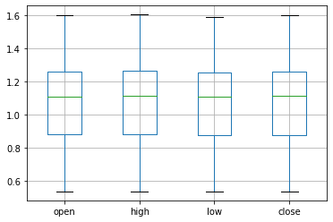

# Analyse_Donnee
[](https://mybinder.org/v2/gh/SMJB4015/Analyse_Donnee.git/main?labpath=index.ipynb)
### :file_folder: Projet : Forex DataSet (EURUSD Pair)


Le marché des changes est un marché mondial décentralisé ou de gré à gré pour le commerce des devises. Ce marché détermine les taux de change pour chaque devise. Il comprend tous les aspects de l'achat, de la vente et de l'échange de devises à des prix courants ou déterminés
### EURUSD Pair

L'EUR/USD est le ticker forex qui indique aux traders combien de dollars américains sont nécessaires pour acheter un euro. La paire euro-dollar est populaire auprès des traders car ses constituants représentent les deux économies les plus importantes et les plus influentes du monde.
#### Install the requirements

> - Install the pandas library using command pip install pandas.
> - Install the numpy library using command pip install numpy.

```import pandas as pd```

```import numpy as np```

```import seaborn as sns```

```import matplotlib.pyplot as plt```

#### Importation de DataSet

| Date       	| open   	| high   	| low    	| close  	| volume 	|
|------------	|--------	|--------	|--------	|--------	|--------	|
| 1971-01-04 	| 0.5369 	| 0.5369 	| 0.5369 	| 0.5369 	| 1      	|
| 1971-01-05 	| 0.5366 	| 0.5366 	| 0.5366 	| 0.5366 	| 1      	|
| 1971-01-06 	| 0.5365 	| 0.5365 	| 0.5365 	| 0.5365 	| 1      	|
| 1971-01-07 	| 0.5368 	| 0.5368 	| 0.5368 	| 0.5368 	| 1      	|
| 1971-01-08 	| 0.5371 	| 0.5371 	| 0.5371 	| 0.5371 	| 1>     	|

:small_orange_diamond: Date = c'est la date de Debut de Bar de 4H.
:small_orange_diamond: Open = c'est le prix d'ouverture .
:small_orange_diamond: Close = c'est le prix de fermeture .
:small_orange_diamond: Low = c'est le prix le plus bas de la Bar .
:small_orange_diamond: Volume = c'est le Volume totale de bar .

Ensuite, on utilise ```.tail``` pour observer les 5 derniers lignes de DataSet, on obtient ceci:

| Date       	| open    	| high    	| low     	| close   	| volume 	|
|------------	|---------	|---------	|---------	|---------	|--------	|
| 2019-05-01 	| 1.12148 	| 1.12644 	| 1.11867 	| 1.11941 	| 52561  	|
| 2019-05-02 	| 1.11942 	| 1.12187 	| 1.11703 	| 1.11709 	| 59203  	|
| 2019-05-03 	| 1.11710 	| 1.13236 	| 1.11346 	| 1.13234 	| 62828  	|
| 2019-05-08 	| 1.11922 	| 1.11927 	| 1.11892 	| 1.11920 	| 698    	|
| 2019-05-09 	| 1.11902 	| 1.11985 	| 1.11860 	| 1.11903 	| 12844> 	|

Ensuite, on utilise ```.shape``` pour observer avoir les dimensions de DataSet, on obtient ceci:

((12115, 5))

12115 lignes et 5 colones
Puis, on utilise ```.info``` pour consulter les details de DataSet, on obtient ceci:

| #   	| Column 	| Non-Null Count 	| Dtype   	| 
|-----	|--------	|----------------	|---------	|
| --- 	| ------ 	| -------------- 	| -----   	|   
| 0   	| open   	| 12115 non-null 	| float64 	|   
| 1   	| high   	| 12115 non-null 	| float64 	|   
| 2   	| low    	| 12115 non-null 	| float64 	|   
| 3   	| close  	| 12115 non-null 	| float64 	|   
| 4   	| volume 	| 12115 non-null 	| int64   	|   
dtypes: float64(4), int64(1)

Pour detecter les valeurs manquantes de Data et consulter la somme de ces valeurs , on utilise ```.isna.sum``` et elle affiche ceci:

| open         	| 0 	| 
|--------------	|---	|
| high         	| 0 	|  
| low          	| 0 	|  
| close        	| 0 	|   
| volume       	| 0 	|   
| dtype: int64 	|   	|   
|              	|   	| 

Pour avoir une description de Data et pour voir quelques valeurs basic de statiques , on utilise ```.describe``` et elle affiche ceci:

| values 	| open         	| high         	| low          	| close        	| volume         	|
|--------	|--------------	|--------------	|--------------	|--------------	|----------------	|
| count  	| 12115.000000 	| 12115.000000 	| 12115.000000 	| 12115.000000 	| 12115.000000   	|
| mean   	| 1.072829     	| 1.076753     	| 1.068981     	| 1.072871     	| 20323.133884   	|
| std    	| 0.234412     	| 0.236481     	| 0.232351     	| 0.234409     	| 37538.102171   	|
| min    	| 0.536500     	| 0.536500     	| 0.536500     	| 0.536500     	| 1.000000       	|
| 25%    	| 0.878950     	| 0.881650     	| 0.875400     	| 0.878700     	| 231.000000     	|
| 50%    	| 1.110700     	| 1.115000     	| 1.107070     	| 1.111100     	| 1891.000000    	|
| 75%    	| 1.257600     	| 1.263790     	| 1.251900     	| 1.257600     	| 11863.000000   	|
| max    	| 1.599500     	| 1.603800     	| 1.586600     	| 1.599700     	| 308716.000000> 	| 

## Visualisation De Data Avec Matplotlib
 ## Courbe
 A travers la commande ```pyplot.plot```, on consulte la courbe des prix d'ouverture en fonction des annees:
 

 ### On constate que la courbe a ete conuite par un trend accendant jusqu'au periode de 2010 au 2013, le trend peut etre dessine en s'appuiant sur les deux points de support de 1985 et 2002 , on deduit que la zone de 0.6 vers 0.85 est une zone de supporte forte

 ## Plot close diagramme


 ### le diagramme mis en evidence les premiers mouvement reels du pair 
 
## Diagramme Bar de Volume


### On Constate ici que le volume des operations du pair EURUSD a multiplie depuis 2010 , on peut bien distinge cette le changement a travers la figure 

## Diagramme Boxplot de tous les caracteristiques de DataSet:

 

 ### A travers ce diagramme ,les moyens de tous les caracteristiques sont presque egaux , tous ces features sont tous dans la meme zone  et  on constate que le prix du pair etait toujours borne par 0.9 et 1.25, cette zone s'est la zone globale de mouvement . 

 ## Diagramme Heatmap de tous les caracteristiques de DataSet:

  

### A travers le heatmap , on peut confirme la resultat precedente , la zone de mouvement est bien precis 

 ## Histogramme de volume :
 
 
 ## ce histogramme rend la vision plus claire pour l'evolution de volume de pair , ici on peut distinguer la date exacte de la debut de l'evolution enorme ,c'etait marquer en decembre 2009 , en revenant a cette periode dans le graphe du courbe , on deduit que c'etait aussi la date du pique historique du pair ou il a marque son valeur maximale historique de 1.6  

 ## Histogramme de open :

 
 ### Ce histogramme confirme l'existance du trend accendant , il bien present dans la figure
 
 ## Lag_plot de open :

 

 ### a travers ce lag plot , il est bien claire qu'il existe une forme non aleatoire des donnees , l'existance de forme , confirme que le donnee ne se comporte pas d'une facon aleatoire    
 
 ## Moving Average 50 Diagramme

 
### La moyenne mobile sur 50 jours (appelée aussi « 50 DMA ») est un indicateur technique fiable utilisé par plusieurs investisseurs pour analyser l'évolution des cours, il s'agit simplement de la moyenne des cours de clôture d'un titre sur les 50 derniers jours.

 ## Moving Average 100 Diagramme

 

 
 
